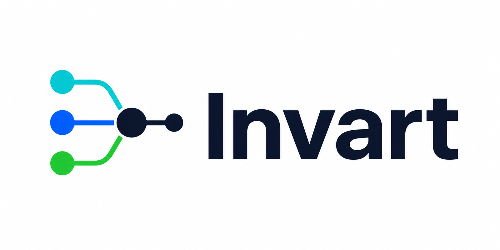

# Invart

Invart is a local-first **agent runtime control plane** for people and teams that run AI agents with real tools, repositories, credentials, shells, MCP servers, skills, plugins, and network access.

It does not try to replace Codex, Claude Code, Gemini CLI, Cursor, OpenCode, or other agent apps. Invart sits around agent execution and gives you a closed loop:

- **Before runtime:** inventory the repo, environment, agent config, skills, MCP servers, tool surfaces, credential boundaries, and policy profile.
- **During runtime:** mediate commands, file activity, network intent, MCP/tool calls, native hook events, identity, approvals, taint, and coverage.
- **After runtime:** produce a ledger, proof, replay, path graph, coverage report, benchmark result, and audit/evidence bundle.

The goal is simple: make agent behavior accountable, policy-aware, and reviewable without turning every low-risk action into a human approval chore.

<p align="center">
  
</p>

## Who This Is For

Invart is useful if you are:

- a developer using coding agents on repositories with secrets, deploy scripts, CI config, or production-adjacent credentials;
- a security or platform team trying to understand what multiple agents did across sessions;
- an open-source maintainer who wants reproducible evidence for agent-assisted changes;
- a team evaluating whether agent workflows can be governed without killing autonomy.

Invart is currently a CLI-first **0.9 pre-release**. It is suitable for local evaluation, demos, experiments, adapter work, and pre-release feedback. It is not yet a hosted enterprise console or kernel-level sandbox.

## What Invart Can Do Now

- Create managed sessions with stable identity, goal, agent, ledger, and environment context.
- Scan pre-runtime surfaces such as repo files, skills, MCP/tool corpora, and native integration points.
- Analyze runtime events for shell, file, network, content, MCP, skills, and policy risk.
- Apply deterministic policy, path-aware checks, approval decisions, and LLM-reviewer-compatible risk explanations.
- Preserve facts in an append-only JSONL ledger and export portable proof.
- Generate replay HTML, path graphs, coverage reports, evidence bundles, audit reports, and release-candidate gates.
- Run built-in benchmarks and demos, including real-world-risk-shaped and containerized risk flows.
- Keep old `kappaski` imports and CLI as compatibility aliases while the public project name moves to `Invart`.

## What To Inspect First

For a first pass, the most useful public-facing surfaces are:

| Surface | Why it matters |
| --- | --- |
| [`docs/product.md`](docs/product.md) | One-page product overview for the before / during / after control loop. |
| [`docs/quickstart.md`](docs/quickstart.md) | Minimal local session that writes a ledger and verifies proof. |
| [`docs/runtime-effect-demo.md`](docs/runtime-effect-demo.md) | Shows the demo's before / during / after stages and L1-L5 control effects. |
| [`docs/evaluation.md`](docs/evaluation.md) | Explains what the built-in benchmarks measure and what they do not claim. |
| [`examples/`](examples/) | Small runnable examples before running the larger demos. |

The main demo command below produces a local HTML entrypoint plus audit, replay, path graph, coverage, proof, and ledger artifacts. Those artifacts are the best way to see Invart intervening in and explaining an agent-like run.

## Install For Local Development

```bash
python -m venv .venv
source .venv/bin/activate
python -m pip install -e .
invart --help
```

The package exposes both commands during the migration:

```bash
invart --help
kappaski --help
```

Use `invart` for new docs, examples, and scripts.

## Five-Minute Quickstart

Create a managed session, record one command, close the session, and verify the proof:

```bash
mkdir -p .invart/quickstart

invart session start \
  --target . \
  --agent demo-agent \
  --goal "Inspect the repository without risky changes" \
  --session-id invart_quickstart \
  --ledger .invart/quickstart/ledger.jsonl

invart runtime shell \
  --session invart_quickstart \
  --ledger .invart/quickstart/ledger.jsonl \
  -- python -c "from pathlib import Path; print(len(list(Path('.').iterdir())))"

invart session close --ledger .invart/quickstart/ledger.jsonl

invart proof export \
  --ledger .invart/quickstart/ledger.jsonl \
  --out .invart/quickstart/proof.json

invart proof verify \
  --proof .invart/quickstart/proof.json \
  --ledger .invart/quickstart/ledger.jsonl
```

The resulting `.invart/quickstart/ledger.jsonl` is the fact source. The proof JSON is the portable summary.

## Try The Risk Demo

Generate a local real-world-risk-shaped demo:

```bash
PYTHONPATH=src python -m invart.cli demo real-world-risk-cases \
  --out-dir .invart/real-world-risk-demo
```

Run the containerized demo, one isolated container per risk case:

```bash
scripts/container-demo.sh all .invart/container-risk-demo
```

The demo emits ledgers, proofs, replay/audit pages, and a suite HTML entrypoint. These cases are safe equivalents of common agent-runtime risks such as unfriendly skills, secret egress, and unsafe deletion.

Key outputs to open after the demo:

- `.invart/real-world-risk-demo/real-world-risk-demo.html`
- `.invart/real-world-risk-demo/live-adapter-demo/audit-report.html`
- `.invart/real-world-risk-demo/live-adapter-demo/replay.html`
- `.invart/real-world-risk-demo/pre-v1-demo/audit-report.html`
- `.invart/real-world-risk-demo/pre-v1-demo/replay.html`
- `.invart/real-world-risk-demo/pre-v1-demo/path-graph.html`
- `.invart/real-world-risk-demo/pre-v1-demo/coverage.html`

## Benchmark And Readiness Checks

```bash
python -m pytest -q
PYTHONPATH=src python -m invart.cli eval benchmark --suite full-product-readiness
PYTHONPATH=src python -m invart.cli eval benchmark --suite real-world-agent-risk-demo
PYTHONPATH=src python -m invart.cli roadmap status --require-full
PYTHONPATH=src python -m invart.cli release-candidate verify --out-dir .invart/rc --skip-pytest
```

Heavy external validation such as full SWE-Bench runs is intentionally separate from the default test suite. Invart distinguishes local product capability from external benchmark evidence.

## Documentation

Open the local docs:

- [Docs README](docs/README.md)
- [Markdown docs home](docs/index.md)
- [HTML docs home](docs/html/index.html)
- [Product page](docs/product.md)
- [Quickstart](docs/quickstart.md)
- [Concepts](docs/concepts.md)
- [CLI reference](docs/cli-reference.md)
- [API and SDK](docs/api-sdk.md)
- [Architecture](docs/architecture.md)
- [Examples](docs/examples.md)
- [Runtime effect demo](docs/runtime-effect-demo.md)
- [Evaluation](docs/evaluation.md)
- [Open-source boundary](docs/open-source-boundary.md)
- [Brand assets](assets/brand/README.md)

## Repository Layout

```text
src/invart/core/       Fact model, ledger, and stable artifact helpers
src/invart/control/    Runtime, policy, mediation, gate, and review plane
src/invart/governance/ Identity, profiles, TeamRun, and grants
src/invart/surfaces/   Adapters, native hooks, MCP, scanner, and enforcement
src/invart/assurance/  Proof, replay, audit, coverage, and evidence bundle
src/invart/evaluation/ Benchmarks, demos, external evidence, and RC gate
src/invart/commands/   CLI parser and command handlers
src/kappaski/          Compatibility import path for older integrations
tests/                 Product-slice tests
benchmarks/            Pinned local fixtures and experiment cases
examples/              Small runnable examples
docs/                  Public Markdown docs plus docs/html HTML site
assets/brand/          Public Invart PNG brand assets generated from the selected original logo
rust/invart-shim/      Source-level Rust enforcement shim prototype
internal/              Local-only design notes and historical planning docs, ignored by git
```

## Security Boundary

Invart is a control plane, not magic containment. Current local capabilities include wrappers, mediation, evidence, policy gates, native/hook integration surfaces, and a source-level Rust shim prototype. It does not yet provide hosted administration, IdP integration, kernel-level enforcement, or guaranteed coverage for agents that intentionally bypass all managed launchers and wrappers.

Critical deterministic rules are not downgraded by LLM judgment. LLM reviewers can explain, classify, or upgrade risk, but they are not the root of trust.

## License

Apache-2.0. See [LICENSE](LICENSE).
