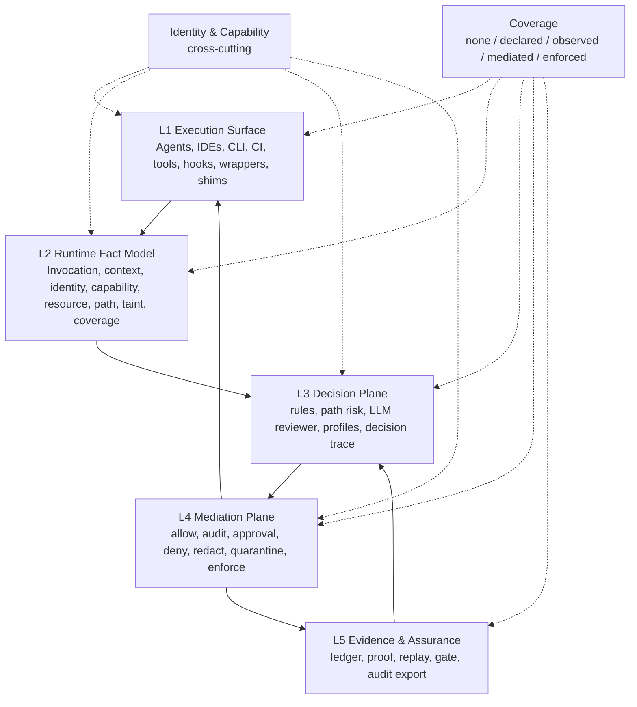

# Kappaski Agent Control Plane Model And Paper Direction

Date: 2026-05-28
Status: working design thesis

## Executive Thesis

Kappaski should be described as an enterprise Agent Control Plane, not as an
agent tracing tool, guardrails SDK, MCP gateway, or report generator.

The core thesis is:

> Kappaski models enterprise agent governance as a five-layer control plane
> operating across three lifecycle stages: pre-runtime discovery, runtime
> mediation, and post-runtime assurance.

The product object is not a trace. It is an accountable execution path:

```text
Principal
  -> Agent
  -> Session
  -> CapabilityGrant
  -> Invocation
  -> Context / Path / Taint
  -> PolicyDecision
  -> Mediation / Approval / Enforcement
  -> ActionOutcome
  -> LedgerEntry
  -> Proof / Replay / Gate
```

Kappaski's strongest design direction is the combination of:

- a compact five-layer control plane model;
- a pre-runtime / runtime / post-runtime lifecycle;
- ledger-first evidence instead of trace-first observability;
- coverage-aware reporting of actual control position;
- a progressive cost model from audit to mediation to enforcement;
- a selective LLM reviewer that is a semantic escalation component, not the
  root of trust.

## Five-Layer Control Plane

The top-level architecture should remain five layers. Earlier nine-layer
breakdowns are useful as capability inventories, but they are too detailed for
the core architecture because some layers do not have stable interfaces or
independent change velocity.

| Layer | Name | Responsibility | Stable input | Stable output |
| --- | --- | --- | --- | --- |
| L1 | Execution Surface | Agents, IDEs, CLIs, CI, tools, native hooks, wrappers, shims, and optional protocol adapters where actions originate or are controlled. | Raw event, command, tool call, hook payload, child process action. | Surface event or execution result. |
| L2 | Runtime Fact Model | Normalize raw activity into canonical facts: invocation, actor, resource, source, trust, capability, path, taint, coverage metadata. | Surface event from L1. | `Invocation + Context`. |
| L3 | Decision Plane | Apply deterministic policy, path risk, semantic review, policy profiles, and decision trace. | `Invocation + Context + PolicyProfile`. | `PolicyDecision` / `PolicyEvaluation`. |
| L4 | Mediation Plane | Turn decisions into operational control: allow, audit, require approval, deny, redact, quarantine, enforce, break-glass. | `PolicyDecision`. | `ActionOutcome` and mediation facts. |
| L5 | Evidence & Assurance Plane | Persist tamper-evident facts, derive proof, replay, gates, audit exports, and enterprise evidence. | Invocation, decision, approval, outcome, coverage facts. | `Ledger`, `Proof`, `Replay`, `GateReport`, audit export. |

The central interface is L2. Every integration path must eventually produce a
canonical `Invocation + Context`; otherwise the rest of the control plane
fragments into vendor-specific logic.

## Three Lifecycle Stages

The five layers describe architecture. The three stages describe operational
lifecycle.

| Stage | Goal | Typical questions |
| --- | --- | --- |
| Pre-runtime | Discover the launch context before an agent acts. | What agents, rules, skills, MCP/tool configs, CI assets, secrets, and capabilities exist? Which policy should apply? What coverage is expected? |
| Runtime | Govern attempted actions as the path unfolds. | What is the agent trying to do? What caused it? Is context tainted? Is the action allowed? Can it be mediated or enforced before side effects? |
| Post-runtime | Transfer trust across time, teams, and boundaries. | Can we prove what happened? Was the ledger intact? Were approvals resolved? Did coverage meet policy? Can CI/review/security teams consume the result? |

The product promise is a closed loop across all three:

```text
Pre-runtime discovery
  -> Runtime decision and mediation
  -> Post-runtime proof and assurance
  -> Policy refinement for the next run
```

## Five Layers By Three Stages

This matrix is the preferred way to explain Kappaski's architecture in product
docs and a future paper.

| Layer / Stage | Pre-runtime | Runtime | Post-runtime |
| --- | --- | --- | --- |
| L1 Execution Surface | Discover agent configs, hooks, wrappers, CI entrypoints, and available enforcement points. | Receive native hook, wrapper, shim, tool, process, file, network, or imported events. | Label which surfaces were covered, bypassed, degraded, or unavailable. |
| L2 Runtime Fact Model | Persist baseline, resource inventory, expected capabilities, and initial trust assumptions. | Produce `Invocation + Context + Path/Taint + Coverage`. | Reconstruct execution paths from ledger facts. |
| L3 Decision Plane | Evaluate risky config, policy drift, suspicious instructions, and broad capability grants. | Decide next action with rules, path state, semantic review, and profile merger. | Analyze policy quality, false positives, unresolved decisions, and gaps. |
| L4 Mediation Plane | Configure default mode, approvals, break-glass, and enforcement domains. | Allow, audit, pause, approve, deny, redact, quarantine, or enforce. | Record overrides, unresolved approvals, denied actions, and break-glass review needs. |
| L5 Evidence & Assurance | Save preflight baseline and hashes. | Append action, decision, approval, outcome, and coverage evidence. | Export proof, replay, gate report, audit report, and SIEM/OTel views. |

## Cross-Cutting Dimensions

The five layers and three stages are the main model. Four additional dimensions
should be treated as analytical lenses rather than extra layers.

### Control Strength

Control strength describes Kappaski's actual control position. This is stronger
than a generic risk score because it says what the system could really do.

| Grade | Meaning | Example |
| --- | --- | --- |
| `none` | Kappaski cannot see or control the behavior. | Agent runs outside any managed surface. |
| `declared` | Kappaski sees the capability/config before runtime, but not the actual action. | Preflight finds an MCP server or native hook config. |
| `observed` | Kappaski sees an event or log, usually after side effects. | Imported agent log or post-tool event. |
| `mediated` | Kappaski is on the execution path and can pause or require approval. | Native pre-tool hook or wrapper policy checkpoint. |
| `enforced` | Kappaski can block the real side effect through a stronger boundary. | File-write shim, sandbox, or proxy-backed deny. |

Coverage should be recorded by dimension:

- `preflight_visibility`;
- `runtime_observation`;
- `runtime_enforcement`;
- `postruntime_audit`.

### Trust Boundary

Trust-boundary analysis explains where risk crossed from one domain into
another.

| Boundary | Governance question |
| --- | --- |
| User -> Agent | Is the agent acting within the user's actual intent and authority? |
| Agent -> Tool | Is the tool call within capability grants and policy? |
| External Content -> Agent | Did an issue, web page, MCP result, or attachment introduce untrusted instructions? |
| Agent -> Local Resource | Did the agent read or mutate secrets, credentials, CI, deploy files, or protected code? |
| Local User -> Organization | Did a local override violate team or enterprise policy? |
| Agent -> Agent | Did handoff or delegation preserve identity, taint, and least privilege? |

### Cost And Friction

Kappaski should be progressive. Stronger control increases adoption cost and
workflow friction, so defaults should be light and risk-sensitive.

| Mode | User experience | Control strength | Best use |
| --- | --- | --- | --- |
| Audit mode | Almost no interruption; generate ledger, proof, and replay. | observed | Personal adoption, early team pilot, low-risk repos. |
| Managed mode | High-risk actions pause for approval or policy resolution. | mediated | Team workflows, sensitive repos, CI preview. |
| Enterprise mode | Identity, profiles, approval, enforcement, audit export, and signoff. | enforced where possible | Security/platform teams and regulated workflows. |

This cost model also applies inside a session:

- low-risk actions should avoid LLM review and human interruption;
- ambiguous semantic risk can trigger selective LLM review;
- high-risk deterministic events should be handled by policy and mediation;
- enforcement should focus first on high-value domains: file mutation,
  secrets/env, network egress, destructive shell commands, and CI/deploy paths.

### Governance Object

Kappaski should make explicit what it governs.

| Object | Examples |
| --- | --- |
| Actor | human user, agent, subprocess, service account, adapter. |
| Capability | shell, file write, network, git push, MCP/tool call, issue update. |
| Resource | file, repo, URL, credential, secret, CI pipeline, deployment target. |
| Context | user prompt, external issue, web content, tool result, skill instruction. |
| Path | read secret -> ingest untrusted issue -> outbound upload. |
| Decision | allow, audit, require approval, deny, redact, quarantine. |
| Evidence | ledger entry, proof fact, approval record, outcome record, replay frame. |

## Top-Down Architecture



The two feedback loops are essential:

- L4 -> L1: mediation must affect the execution surface, otherwise Kappaski is
  only observability.
- L5 -> L3: evidence should refine policy, baselines, allowlists, false-positive
  handling, and future proof/gate expectations.

## Current Kappaski Mapping

| Layer | Current modules | Current maturity | Important gaps |
| --- | --- | --- | --- |
| L1 Execution Surface | `adapter.py`, `claude_adapter.py`, `native.py`, `native_bridge.py`, `enforcement.py`, Rust shim | Local wrapper, Claude adapter, native inventory/bridge, file-write enforcement slice. | Stable native conformance, process-tree supervision, broader env/network enforcement. |
| L2 Runtime Fact Model | `models.py`, `runtime.py`, `coverage.py`, `teamrun.py`, `corpus.py` | Strong canonical invocation and ledger facts; TeamRun and coverage facts exist. | Formal identity/principal binding, richer path graph, capability/delegation proof. |
| L3 Decision Plane | `rules.py`, `policy.py`, `review.py`, `profiles.py` | Deterministic rules, semantic reviewer, profiles, policy merger. | Policy-as-code depth, path-aware policy language, reviewer cost budgets. |
| L4 Mediation Plane | `approval.py`, `daemon.py`, `enforcement.py`, adapter enforcement options | Approval evidence, daemon-mediated writes, wrapper-level blocking. | Enterprise approval workflow, break-glass review, signoff, stricter enforcement modes. |
| L5 Evidence & Assurance | `ledger.py`, `postruntime.py`, `replay.py`, `gate.py`, `audit_demo.py` | Hash-chain ledger, proof, replay, gate, audit demo. | Signatures/replication, SIEM/OTel export, enterprise evidence templates. |

## Agent-BOM As A Representation Reference

The Agent-BOM paper is highly relevant but should not replace the Kappaski
architecture. It should be treated as a strong reference for the representation
inside L2 Runtime Fact Model and L5 Evidence & Assurance Plane.

Agent-BOM's core claim is:

> agent security auditing requires a unified graph representation that connects
> static capability bases with dynamic runtime semantic states.

Kappaski's core claim is broader:

> enterprise agent governance requires a five-layer, three-stage runtime control
> plane that can discover, decide, mediate, enforce where possible, and prove
> what happened.

### Conceptual Difference

| Dimension | Agent-BOM | Kappaski |
| --- | --- | --- |
| Core problem | How to represent agent execution for security auditing and root-cause analysis. | How to govern agent execution across pre-runtime, runtime, and post-runtime. |
| Primary artifact | Hierarchical attributed directed graph. | Accountable execution path backed by ledger, proof, replay, and gate. |
| Main strength | Static capability layer + runtime semantic layer + path-level graph queries. | Five-layer control plane with mediation, approvals, enforcement surfaces, and coverage-aware assurance. |
| Control position | Explicitly not a standalone defense or policy enforcement mechanism. | Intends to mediate and enforce where hooks, wrappers, proxies, shims, or sandboxes permit. |
| Trust assumption | Assumes telemetry collection and storage are faithful and tamper-proof. | Makes tamper-evident ledger and proof verification part of the core model. |
| Coverage model | Discusses incomplete instrumentation as a limitation. | Treats coverage grade as a first-class fact: `none`, `declared`, `observed`, `mediated`, `enforced`. |

### Mapping Agent-BOM Into Kappaski

| Agent-BOM concept | Kappaski equivalent / target |
| --- | --- |
| Static capability layer | Pre-runtime inventory, `CapabilitySurface`, `CapabilityGrant`, adapter profiles, Skill/tool/native integration records. |
| Runtime semantic layer | `Invocation`, future path graph nodes for goal, context, reasoning, decision, action, observation. |
| Structural dependency edges | Preflight and capability grant relationships. |
| Runtime evolution edges | `input_refs`, `output_refs`, `correlation_id`, taint propagation, future path graph. |
| Cross-layer binding edges | Capability grant id, tool/skill/resource refs, selected tool/action evidence. |
| Cross-agent propagation edges | TeamRun, Handoff, Blackboard, delegation records. |
| Security attributes | `source`, `trust_level`, `taint_tags`, approval status, outcome, coverage grade, redaction/evidence refs. |
| Graph query auditing | Post-runtime replay/gate/audit queries: entry localization, backward tracing, forward tracing, adjudication. |

### Product Implication

Kappaski should not become only an Agent-BOM-style graph auditor. The better
direction is:

1. keep the ledger as the source of truth;
2. derive an Agent-BOM-like graph from ledger facts;
3. use that graph for post-runtime path reconstruction, audit queries, and
   root-cause reports;
4. feed graph-derived risk findings back into policy profiles and pre-runtime
   baselines;
5. keep runtime mediation and enforcement in L4 rather than moving them into
   the graph representation.

This preserves Kappaski's main differentiation:

```text
Agent-BOM: auditable graph representation.
Kappaski: runtime control plane that can produce and consume auditable graphs.
```

## LLM Reviewer Position

The LLM reviewer is not a separate layer. It belongs inside L3 Decision Plane as
a selective semantic reviewer.

```text
L2 Runtime Fact Model
  Invocation + Context + Path Summary + Taint
        |
        v
L3 Decision Plane
  deterministic rules
  path risk classifier
  selective LLM semantic reviewer
  policy profile merger
  decision trace
        |
        v
L4 Mediation Plane
```

Cost guidance:

- deterministic critical findings should not need LLM review to deny;
- common low-risk actions should avoid LLM review entirely;
- LLM review should be invoked for ambiguous semantic risk, external
  instruction influence, tainted write-like actions, and human-readable
  explanations where policy allows;
- reviewer input should use redacted path summaries rather than raw full
  transcripts whenever possible;
- cache keys should include `input_hash`, `policy_version`, `reviewer_kind`,
  and `model`;
- policy profiles should support review budgets and `off`, `auto`,
  `required`, and `audit_async` modes.

## Industry Pain Points Addressed

| Pain point | Why it matters | Kappaski answer |
| --- | --- | --- |
| Agent sprawl | Teams use multiple local/IDE/CI agents with inconsistent logs and policies. | Common invocation model, adapter layer, session registry. |
| Unclear accountability | Incidents often collapse into "an agent did it." | Actor, agent, adapter, session, decision, approval, outcome facts. |
| Tool-call overreach | IAM/OAuth says what service is reachable, not what the agent may do once connected. | Capability grants, policy decisions, mediation, enforcement domains. |
| Prompt injection through tools/content | Untrusted data can influence later file/network/write actions. | Source/trust/taint/path model with escalation on risky downstream actions. |
| Approval gaps | Terminal or chat approvals often lose context and auditability. | Approval evidence with reason, approver, decision id, and context refs. |
| Weak audit logs | Ordinary logs can be edited, deleted, or detached from decisions. | Append-only hash-chain ledger and proof verification. |
| Overclaimed control | Many systems see some tool calls but cannot state coverage gaps. | Coverage grade across observed/mediated/enforced dimensions. |
| CI/review blind spot | Agent-modified code enters PR review without runtime behavior evidence. | Proof export, replay, and gate verification. |

## Paper Direction

Recommended working title:

> Kappaski: A Ledger-First, Coverage-Aware Runtime Control Plane for AI Coding Agents

Potential paper claim:

> We present a five-layer, three-stage runtime governance model for AI coding
> agents, and implement it in Kappaski, a local-first control plane that
> separates facts, decisions, approvals, outcomes, and assurance evidence while
> reporting the actual coverage strength of each controlled action.

### Proposed Contributions

1. A five-layer Agent Control Plane architecture:
   Execution Surface, Runtime Fact Model, Decision Plane, Mediation Plane, and
   Evidence & Assurance.
2. A three-stage lifecycle:
   pre-runtime discovery, runtime mediation, and post-runtime assurance.
3. A closed-loop fact model separating finding, taint, decision, approval,
   outcome, ledger, proof, and coverage.
4. A coverage model that reports actual control position rather than a generic
   risk score.
5. A local-first prototype for coding-agent workflows with proof, replay, gate,
   approval, and wrapper/shim-backed enforcement slices.
6. An evaluation of security effectiveness, false positives, latency, review
   cost, and audit utility.

### Research Questions

| Question | Measurement idea |
| --- | --- |
| Can Kappaski detect and mediate high-risk agent action paths before irreversible side effects? | Attack corpus pass rate, blocked-before-execution rate, approval escalation rate. |
| Does the fact separation improve audit reconstruction? | Ability to reconstruct attack path, decision chain, approval chain, and outcome from proof/ledger. |
| What is the overhead of progressive control? | Median/p95 latency for audit, mediated, and enforced paths; LLM reviewer token and latency costs. |
| Can coverage grade prevent overclaiming control? | Compare hook-only, wrapper, shim, and imported-log scenarios for the same action class. |
| Does selective LLM review reduce cost without losing semantic risk coverage? | Compare `off`, `auto`, `required`, and `audit_async` modes on benign and attack workloads. |

### Evaluation Plan

Minimum credible paper evaluation:

- Security workloads:
  - AgentDojo-like indirect prompt injection scenarios;
  - Kappaski-specific coding-agent cases: secret read -> network upload,
    untrusted issue -> destructive shell, dependency/script injection,
    CI/deploy mutation, broad capability grant.
- Benign workloads:
  - SWE-Bench Lite-style command and patch workflows;
  - local coding sessions with common shell/file/git commands.
- Metrics:
  - attack block rate;
  - human approval rate;
  - false positive rate on benign workflows;
  - unresolved approval rate;
  - p50/p95 mediation latency;
  - LLM reviewer calls, tokens, and cache hit rate;
  - proof completeness;
  - coverage distribution;
  - audit reconstruction success.

### Claims To Avoid

Do not claim:

- complete OS-level prevention unless kernel/sandbox enforcement exists;
- universal coverage across all agent tools;
- LLM reviewer as root of trust;
- proof-only verification as equivalent to proof+ledger verification;
- MCP/A2A support as the product core.

Preferred wording:

> Kappaski provides audit-and-attest in observed paths, mediation where it is on
> the execution path, and enforcement only where wrappers, shims, proxies, or
> sandboxes can block the real side effect.

## Short-Term Product Priorities

For an enterprise-level Agent Control Plane, the short-term core should be:

1. Keep the five-layer model and pre/runtime/post lifecycle as the canonical
   design language.
2. Strengthen identity and capability facts: principal, agent identity,
   credential binding, grant, delegation, and handoff semantics.
3. Complete coverage-aware proof, replay, gate, and audit reporting.
4. Harden pre-execution mediation for file-write, secrets/env, network egress,
   destructive shell, and CI/deploy files.
5. Add policy profile distribution and policy-as-code compatibility without
   making an external policy language a blocker.
6. Treat LLM reviewer as selective and budgeted.
7. Keep MCP/A2A as adapter slots, not short-term product centers.
