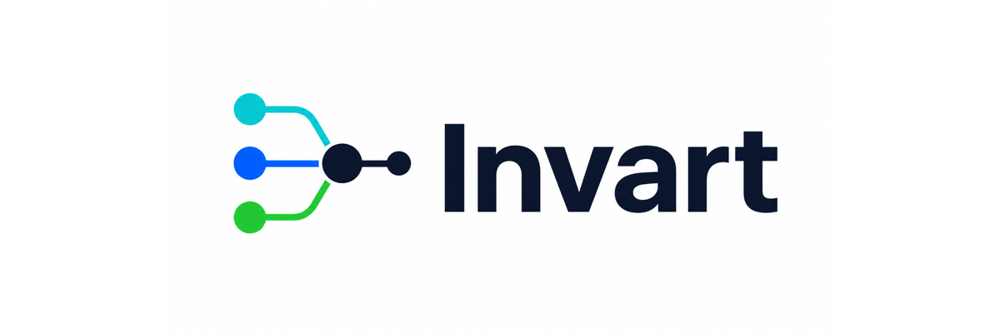

# Agent Runtime Control Plane

[HTML version](html/index.html)

Use Invart to discover agent runtime risk before execution, mediate behavior during execution, and produce verifiable evidence after execution.

[Product](product.md) · [Quickstart](quickstart.md) · [CLI](cli-reference.md) · [API & SDK](api-sdk.md) · [Architecture](architecture.md) · [Evaluation](evaluation.md)

## Start

### [Product Overview](product.md)

What Invart is, who it helps, and how the three-stage control loop works.

### [Quickstart](quickstart.md)

Install locally, create a managed session, record one action, export proof, and verify it.

### [Examples](examples.md)

Runnable examples for local sessions, policy profiles, risk demos, and containerized flows.

### [Runtime Effect Demo](runtime-effect-demo.md)

Read the demo matrix and action timeline that map before / during / after runtime to L1-L5.

## Understand

### [Core Concepts](concepts.md)

Ledger, proof, policy, mediation, path graph, coverage, approval, and evidence bundle.

### [Architecture](architecture.md)

Three stages, five layers, and how adapters, daemon state, policy, ledger, and proof fit together.

### [Release History](release-history.md)

A compact public summary of the implementation tracks behind the 0.9 pre-release.

## Integrate

### [CLI Reference](cli-reference.md)

The practical command groups users should automate first.

### [API & SDK](api-sdk.md)

The stable CLI and artifact contracts, plus provisional Python helper entry points.

## Evaluate

### [Evaluation](evaluation.md)

Built-in benchmarks, product-effectiveness metrics, and external validation boundaries.

### [Open-source Boundary](open-source-boundary.md)

What is intended for GitHub and what stays in local internal planning.
