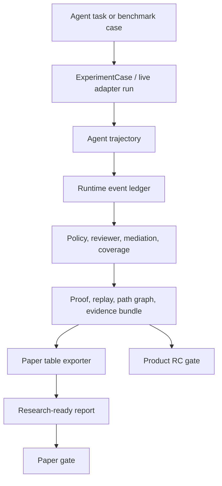
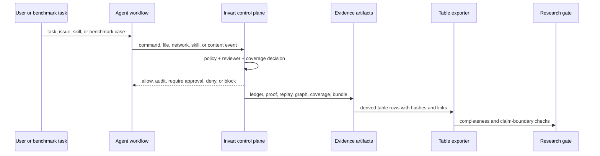

# feat: Build pre-1.0 research-ready experiment gates

## Summary

This plan turns Invart's existing pre-release experiment substrate into a research-ready validation system for v0.46-v0.51. The work centers on LLM and agent workflows: each experiment must preserve an agent trajectory, Invart runtime actions, mediation decisions, coverage labels, and evidence artifacts that can be exported into paper-ready tables and release gates.

---

## Problem Frame

Invart already has local control-plane capabilities, demos, benchmark-shaped suites, progressive external validation, and a pre-1.0 RC gate. The gap is that the paper and pre-release story still need reproducible measured evidence, not only architecture and demo output. The next versions should make claims falsifiable: high-risk paths must show blocked or approval-before-side-effect outcomes; benign workflows must show low friction; coverage claims must not overstate control strength; LLM review must show cost and non-downgrade behavior; audit artifacts must answer reconstruction questions.

The work should not make full SWE-Bench, hosted enterprise, IdP, UI, or kernel-level enforcement mandatory for pre-1.0. Those remain attachable external or post-1.0 tracks.

---

## Requirements

- R1. Generate paper-ready result tables from actual Invart experiment outputs rather than manually maintained metrics.
- R2. Preserve full LLM/agent workflow evidence for every table row: prompt or task source, agent trace, runtime events, decision, mediation outcome, coverage label, and artifact links.
- R3. Validate risk-path mediation on managed surfaces with blocked-before-execution or approval-before-execution evidence.
- R4. Validate benign agent workflows with low approval noise and stable artifact compatibility.
- R5. Prove coverage truthfulness by comparing the same action under observed-only, mediated, enforced, fail-open, and bypassed surfaces.
- R6. Score audit reconstruction from ledger-derived proof, replay, path graph, coverage, and evidence bundles.
- R7. Measure reviewer modes, including deterministic-only and selective LLM review, without allowing LLM output to downgrade deterministic critical policy.
- R8. Compare vendor-native, plugin-only, trace-only, and Invart-mediated control positions using the same coverage vocabulary.
- R9. Add a research-ready gate that can fail independently from the product RC gate.
- R10. Keep optional live LLM and heavy external benchmark runs out of default CI while making their evidence attachable and verifiable.

---

## Key Technical Decisions

- KTD1. Use existing `ExperimentCase` and ledger artifacts as the fact source: table exporters should derive from existing experiment run outputs and evidence bundles instead of introducing a parallel metrics database.
- KTD2. Treat LLM/agent workflow tests as product tests: tests must assert trajectory, policy decision, mediation outcome, coverage, and evidence artifacts together.
- KTD3. Keep local deterministic CI and optional live validation separate: deterministic traces run by default; live OpenAI-compatible reviewer runs and full external benchmarks are opt-in evidence.
- KTD4. Add a separate paper/research gate: product `release-candidate verify` can pass while the research gate reports missing scholarly evidence.
- KTD5. Do not claim stronger enforcement than the surface supports: observed, mediated, enforced, fail-open, and bypass labels must remain distinct in JSON, HTML, proof, and table outputs.
- KTD6. Make table rows stable and reproducible: every row should have a stable row ID, source suite, case ID, fixture hash or evidence hash, metric values, and claim boundary.

---

## High-Level Technical Design

The core invariant is that table data is derived from ledger-backed artifacts. A table row is not evidence by itself; it points back to the run, ledger, proof, replay, graph, coverage, and evidence bundle that produced it.

---

## Scope Boundaries

### In Scope

- v0.46-v0.51 implementation planning.
- Paper-ready table export and research-ready gate.
- LLM/agent workflow tests over deterministic traces and optional live provider runs.
- Local product experiments, containerized risk demos, progressive validation evidence, and attachable external evidence.
- Public docs only where release users need to understand the new commands or gates.

### Deferred to Follow-Up Work

- Running the complete official full SWE-Bench dataset as part of this plan.
- Hosted UI, hosted enterprise admin, IdP/SCIM, SIEM/OTel production export, and kernel-level enforcement.
- Full scholarly related-work writing, BibTeX cleanup, and paragraph-level manuscript polish.

### Outside This Product Identity

- Claiming Invart prevents all prompt injection.
- Claiming plugin-only integration is equivalent to runtime mediation.
- Claiming local benchmark-shaped suites equal full upstream benchmark validation.

---

## Implementation Units

### U1. v0.46 Paper Evidence Tables

- **Goal:** Generate stable JSON, CSV, and HTML tables from existing experiment outputs for paper and release evidence.
- **Requirements:** R1, R2, R3, R4, R6.
- **Dependencies:** None.
- **Files:**
  - Create `src/invart/evaluation/paper_tables.py`
  - Modify `src/invart/evaluation/experiment_cases.py`
  - Modify `src/invart/commands/parser_product.py`
  - Modify `src/invart/commands/product.py`
  - Modify `src/invart/benchmarks/registry.py`
  - Modify `src/invart/evaluation/benchmark_registry.py`
  - Modify `src/invart/evaluation/roadmap.py`
  - Test `tests/test_experiments.py`
- **Approach:** Add a table exporter that consumes paper-suite results and produces rows for risky path outcomes, benign friction, coverage, reviewer cost, audit reconstruction, and external-shaped corpus mapping. Each row should carry `table_id`, `row_id`, `suite`, `case_id`, `agent_workflow_kind`, metric fields, artifact links, evidence hash, and claim boundary. Add an `experiment paper-tables` CLI surface and a `v0.46-paper-evidence-tables` benchmark.
- **Execution note:** Implement test-first because this defines a new artifact contract.
- **Patterns to follow:** `run_paper_suite`, `export_experiment_report`, `write_json_artifact`, `write_html_artifact`, and benchmark registration patterns in `src/invart/benchmarks/registry.py`.
- **Test scenarios:**
  - Running table export over a paper suite produces all required table IDs with stable row IDs.
  - A risky agent trace row links to ledger, proof, replay, path graph, and evidence bundle artifacts.
  - A benign SWE-Bench-like workflow row reports auto-approval and approval-noise metrics without claiming task success improvement.
  - Missing artifact links or missing claim boundaries fail table validation.
  - CLI invocation returns nonzero when the input paper-suite run is malformed.
  - Benchmark `v0.46-paper-evidence-tables` passes and appears in `eval list`.
- **Verification:** The generated table bundle can populate the paper's risk, friction, reviewer, coverage, and audit tables without manual metric transcription.

### U2. v0.47 Coverage And Mediation Pilot

- **Goal:** Show the same agent action under observed-only, mediated, enforced, fail-open, and bypassed control positions.
- **Requirements:** R2, R5, R10.
- **Dependencies:** U1.
- **Files:**
  - Modify `src/invart/evaluation/coverage_experiments.py`
  - Modify `src/invart/assurance/coverage.py`
  - Modify `src/invart/evaluation/paper_tables.py`
  - Modify `src/invart/benchmarks/registry.py`
  - Modify `src/invart/evaluation/benchmark_registry.py`
  - Modify `src/invart/evaluation/roadmap.py`
  - Test `tests/test_experiments.py`
  - Test `tests/test_integrations.py`
- **Approach:** Expand coverage truthfulness from a surface matrix into a same-action pilot. Use one representative side-effect action, then replay it through imported log, post-tool hook, pre-tool hook, wrapper, shim/proxy, fail-open, and bypass cases. Emit coverage-ladder artifacts with action identity, surface, expected label, actual label, and whether the artifact supports the claim.
- **Execution note:** Start with tests that fail if an observed-only case is reported as mediated or enforced.
- **Patterns to follow:** `default_coverage_for_layer`, `evaluate_coverage_gate`, `run_coverage_truthfulness_matrix`, and v0.43 coverage-gate tests.
- **Test scenarios:**
  - The same network egress action is labeled observed-only when imported from logs.
  - The same action is labeled mediated when passing through a pre-tool hook or managed launcher.
  - The same action is labeled enforced only when the configured surface supports enforced blocking.
  - A fail-open action emits critical alert evidence and is not reported as enforced.
  - A bypassed action becomes a coverage gap and fails a strict research gate.
  - The coverage table exporter includes all coverage positions and links each row to evidence.
- **Verification:** Coverage claims in demo, table, proof, and gate outputs stay consistent for the same action across surfaces.

### U3. v0.48 Audit Reconstruction Study Harness

- **Goal:** Score whether proof, replay, path graph, coverage, and evidence bundles answer audit questions.
- **Requirements:** R2, R6, R9.
- **Dependencies:** U1.
- **Files:**
  - Create `src/invart/evaluation/audit_reconstruction.py`
  - Modify `src/invart/evaluation/audit_experiments.py`
  - Modify `src/invart/evaluation/paper_tables.py`
  - Modify `src/invart/benchmarks/registry.py`
  - Modify `src/invart/evaluation/benchmark_registry.py`
  - Modify `src/invart/evaluation/roadmap.py`
  - Test `tests/test_experiments.py`
  - Test `tests/test_policy_evidence_rc.py`
- **Approach:** Define scripted audit questions with expected answers for normal, blocked, approved, tampered, and proof/ledger mismatch runs. Score `who`, `what`, `why`, `policy`, `approval`, `outcome`, `coverage`, `artifact_integrity`, and `path_trace`. Emit a reconstruction report and table rows that make missing evidence visible.
- **Execution note:** Add characterization tests around current `run_audit_tamper_assurance` before expanding it.
- **Patterns to follow:** `export_evidence_bundle`, `verify_evidence_bundle`, `verify_ledger`, `export_proof_report`, and existing audit/tamper assurance output.
- **Test scenarios:**
  - A normal blocked-risk run answers all required audit questions.
  - An approved high-risk run records approval actor, reason, and outcome.
  - A tampered ledger fails integrity scoring.
  - A proof/ledger mismatch fails artifact consistency scoring.
  - Removing identity, decision, approval, outcome, or coverage evidence lowers the score and names the missing field.
  - The table exporter includes reconstruction success, missing-field rate, and tamper detection rate.
- **Verification:** Audit reconstruction is measured with explicit pass/fail scoring instead of asserted by prose.

### U4. v0.49 Reviewer Ablation And Cost Accounting

- **Goal:** Evaluate deterministic-only, selective, always-on, async-audit, and optional live LLM reviewer modes.
- **Requirements:** R2, R7, R10.
- **Dependencies:** U1.
- **Files:**
  - Modify `src/invart/evaluation/reviewer_experiments.py`
  - Modify `src/invart/control/review.py`
  - Modify `src/invart/evaluation/product_readiness.py`
  - Modify `src/invart/evaluation/paper_tables.py`
  - Modify `src/invart/benchmarks/registry.py`
  - Modify `src/invart/evaluation/benchmark_registry.py`
  - Modify `src/invart/evaluation/roadmap.py`
  - Test `tests/test_experiments.py`
  - Test `tests/test_policy_evidence_rc.py`
- **Approach:** Normalize reviewer modes and record call rate, prompt/response token estimates or live token counts, latency, cost, risk upgrade rate, over-escalation proxy, invalid output rate, and redaction behavior. Live OpenAI-compatible calls remain optional through environment configuration. Deterministic critical rules remain non-downgradable under all modes.
- **Execution note:** Test deterministic non-downgrade before adding live-provider accounting.
- **Patterns to follow:** `optional_provider_smoke`, `LLMReviewer`, `reviewer_quality_corpus`, and current reviewer selectivity experiment.
- **Test scenarios:**
  - Deterministic critical secret egress remains deny or approval-required even if an LLM allow response is simulated.
  - Selective mode calls the reviewer for ambiguous semantic risk but not for benign low-risk reads.
  - Always-on mode has a higher call rate than selective mode.
  - Async-audit mode records explanatory audit evidence without changing deterministic outcomes.
  - Raw content is redacted, folded, or truncated according to profile before reviewer input is persisted.
  - Live provider tests skip cleanly unless explicit provider variables and live-run flag are present.
  - Table rows include call rate, tokens, cost, latency, and safety delta.
- **Verification:** The reviewer can be discussed as cost-aware semantic assistance without becoming the root of trust.

### U5. v0.50 Vendor/Product Control Matrix And Plugin-Only Baseline

- **Goal:** Compare product-native, plugin-only, trace-only, and Invart-mediated control positions with truthful coverage grades.
- **Requirements:** R5, R8, R10.
- **Dependencies:** U2.
- **Files:**
  - Create `src/invart/evaluation/product_control_matrix.py`
  - Modify `src/invart/surfaces/native.py`
  - Modify `src/invart/evaluation/paper_tables.py`
  - Modify `src/invart/benchmarks/registry.py`
  - Modify `src/invart/evaluation/benchmark_registry.py`
  - Modify `src/invart/evaluation/roadmap.py`
  - Modify `.internal/paper/vendor-agent-security-matrix.md`
  - Test `tests/test_integrations.py`
  - Test `tests/test_experiments.py`
- **Approach:** Formalize matrix rows for Claude Code, Codex/OpenAI Agents SDK, Hermes/OpenClaw-style runtimes, and optional appendix products. Each row should name source evidence, native control type, Invart layer mapping, coverage grade, import path, blind spot, and whether the surface supports observation, mediation, enforcement, or only vendor-owned evidence. Add plugin-only and trace-only baselines that cannot satisfy mediated/enforced claims.
- **Execution note:** Treat source metadata as required; matrix entries without source and limitation should fail validation.
- **Patterns to follow:** `native_capability_matrix`, `unmanaged_agent_inventory`, current vendor matrix notes, and v0.41-v0.43 coverage benchmarks.
- **Test scenarios:**
  - Every matrix row has source, product, surface, native control, layer mapping, coverage grade, and limitation.
  - Plugin-only baseline records observed or vendor-owned coverage, not mediated or enforced coverage.
  - Invart-managed launcher baseline can satisfy mediated coverage when installed and verified.
  - Trace-only baseline can support audit reconstruction but not pre-side-effect mediation.
  - Unknown or unregistered agent surfaces are reported as coverage gaps.
  - Table export includes vendor matrix and plugin-only comparison rows.
- **Verification:** Invart's paper and product docs can explain why product-native controls are complementary rather than competitors.

### U6. v0.51 Pre-1.0 Research-Ready Gate

- **Goal:** Add an honest research-ready gate that aggregates paper evidence without blocking normal product RC.
- **Requirements:** R1, R2, R6, R7, R8, R9, R10.
- **Dependencies:** U1, U2, U3, U4, U5.
- **Files:**
  - Create `src/invart/evaluation/research_readiness.py`
  - Modify `src/invart/evaluation/release_candidate.py`
  - Modify `src/invart/commands/parser_product.py`
  - Modify `src/invart/commands/product.py`
  - Modify `src/invart/benchmarks/registry.py`
  - Modify `src/invart/evaluation/benchmark_registry.py`
  - Modify `src/invart/evaluation/roadmap.py`
  - Test `tests/test_policy_evidence_rc.py`
  - Test `tests/test_experiments.py`
- **Approach:** Add a `--paper` or dedicated research-readiness mode that checks experiment protocol, table bundle, coverage pilot, audit reconstruction, reviewer ablation, vendor matrix, claim-boundary text, and optional external evidence status. Keep product RC green when product requirements pass, even if research artifacts are incomplete; report research status separately.
- **Execution note:** Implement gate tests first because this command becomes the final acceptance boundary for v0.46-v0.51.
- **Patterns to follow:** `verify_release_candidate`, `verify_roadmap_coverage`, `verify_external_evidence`, and final readiness state handling.
- **Test scenarios:**
  - Product RC passes without paper artifacts when normal product checks pass.
  - Research gate fails if paper tables are missing.
  - Research gate fails if coverage table inflates observed-only into mediated or enforced.
  - Research gate fails if reviewer ablation lacks cost fields or non-downgrade evidence.
  - Research gate reports external heavy validation as optional unless explicitly required.
  - Research gate passes when all local research artifacts exist and verify.
  - CLI alias and JSON/HTML report artifacts are generated.
- **Verification:** Invart can report `local_rc_ready`, `research_ready`, `external_pending`, and `final_ready` without conflating them.

### U7. Documentation And Paper Protocol Sync

- **Goal:** Keep public docs, internal paper docs, and roadmap capability status aligned with the new experiment gates.
- **Requirements:** R1, R8, R9, R10.
- **Dependencies:** U1-U6.
- **Files:**
  - Modify `docs/evaluation.md`
  - Modify `docs/html/evaluation.html`
  - Modify `docs/release-history.md`
  - Modify `docs/html/release-history.html`
  - Modify `docs/api-sdk.md`
  - Modify `docs/html/api-sdk.html`
  - Modify `.internal/paper/writing-roadmap.md`
  - Modify `.internal/paper/claims-and-evidence.md`
  - Create or modify `.internal/paper/experiment-protocol.md`
  - Test `tests/test_policy_evidence_rc.py`
- **Approach:** Public docs should explain commands and boundaries, not manuscript strategy. Internal paper docs should map claims C1-C9 to generated artifacts and state which evidence is local, progressive, optional live, or final external.
- **Execution note:** Update docs after behavior and artifact names are stable.
- **Patterns to follow:** current public docs split between Markdown and HTML, `DEFAULT_REQUIRED_DOCS`, and existing internal paper workspace structure.
- **Test scenarios:**
  - Public docs link the new evaluation and API surfaces.
  - RC required docs include only public product docs, not internal paper workspace files.
  - Internal claim matrix references generated artifact names rather than hand-written result claims.
  - HTML docs parse and local links stay valid.
- **Verification:** A release user sees honest product usage; a paper author sees claim-to-evidence mapping.

---

## LLM And Agent Workflow Test Strategy

The test strategy has four layers. Each version should add coverage at the lowest layer that proves the behavior, then one product-level test that proves the agent workflow effect.

| Layer | Purpose | Required Evidence |
| --- | --- | --- |
| Deterministic unit contract | Validate schemas, row IDs, coverage labels, and gate states. | Python unit tests over functions and artifact JSON. |
| Agent workflow integration | Validate an LLM-like task trajectory through Invart. | `agent_trace`, ledger, decision, outcome, proof, replay, path graph, evidence bundle. |
| CLI and benchmark loop | Validate user-facing commands and suite registration. | CLI return code, benchmark pass, generated JSON/HTML report. |
| Optional live/heavy validation | Validate live provider or upstream benchmark evidence when configured. | Explicit opt-in manifest with hashes, skipped state when not configured. |

Every feature-bearing version should include at least one workflow test where the input looks like an agent task, not a bare function fixture. Examples include issue text leading to a file/network action, skill instruction leading to a capability grant, SWE-Bench-like benign repair inspection, and reviewer classification over ambiguous content.

---

## Acceptance Examples

- AE1. Given a secret-egress agent trace, when v0.46 table export runs, then the risk path table row links back to ledger, proof, replay, path graph, and evidence bundle.
- AE2. Given the same network action under imported-log and managed-wrapper surfaces, when v0.47 coverage pilot runs, then imported-log is not labeled mediated and managed-wrapper is not labeled enforced unless the surface supports enforcement.
- AE3. Given a tampered ledger, when v0.48 audit reconstruction runs, then artifact integrity fails and the missing or changed field is reported.
- AE4. Given a deterministic critical rule and an LLM reviewer allow response, when v0.49 reviewer ablation runs, then deterministic deny or approval-required remains in force.
- AE5. Given plugin-only evidence, when v0.50 product matrix validates, then it cannot satisfy mediated or enforced coverage.
- AE6. Given product RC artifacts but no paper tables, when v0.51 research-ready gate runs, then product RC can pass and research gate fails with missing paper evidence.

---

## System-Wide Impact

This work changes the evaluation contract more than the runtime contract. It adds new artifacts and gates that downstream users may script against, so schemas should be treated as public pre-1.0 surfaces once documented. It also tightens claim integrity: future roadmap entries must state whether evidence is deterministic local, simulated agent trace, progressive external sample, optional live provider, or full external validation.

---

## Risks And Dependencies

| Risk | Mitigation |
| --- | --- |
| Table exporter becomes a parallel source of truth. | Derive tables from ledger-backed experiment outputs and include artifact hashes. |
| Tests become too synthetic. | Require at least one agent workflow integration test per version. |
| Live LLM tests become flaky or costly. | Keep live provider runs opt-in and record skipped state honestly. |
| Research gate blocks product release unnecessarily. | Keep product RC and research-ready gate separate. |
| Coverage labels drift across demo, proof, and tables. | Add cross-artifact assertions for the same action and coverage position. |
| Vendor matrix becomes stale. | Require source metadata and limitations per row, and treat refresh as a paper-track update. |

---

## Documentation And Operational Notes

Public documentation should add only user-facing commands and release boundaries. Internal paper documentation should carry experiment protocol, claim-to-evidence mapping, and generated result references. Generated `.invart/` artifacts remain ignored by git unless intentionally copied into an internal paper artifact bundle.

---

## Sources And Research

- `.internal/paper/writing-roadmap.md` defines the missing paper evidence and table requirements.
- `.internal/paper/claims-and-evidence.md` maps claims C1-C9 to needed evidence and risks.
- `src/invart/evaluation/experiment_cases.py` is the existing agent-trace experiment substrate.
- `src/invart/evaluation/coverage_experiments.py` is the existing coverage truthfulness baseline.
- `src/invart/evaluation/reviewer_experiments.py` is the existing reviewer selectivity baseline.
- `src/invart/evaluation/audit_experiments.py` is the existing audit/tamper baseline.
- `src/invart/evaluation/release_candidate.py` is the existing product RC gate.
- `src/invart/benchmarks/registry.py` and `src/invart/evaluation/benchmark_registry.py` are the benchmark registration surfaces.
- `tests/test_experiments.py`, `tests/test_policy_evidence_rc.py`, and `tests/test_integrations.py` are the primary test files to extend.
