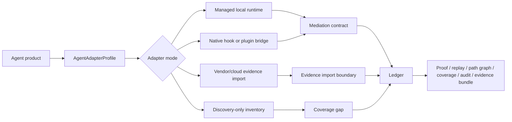
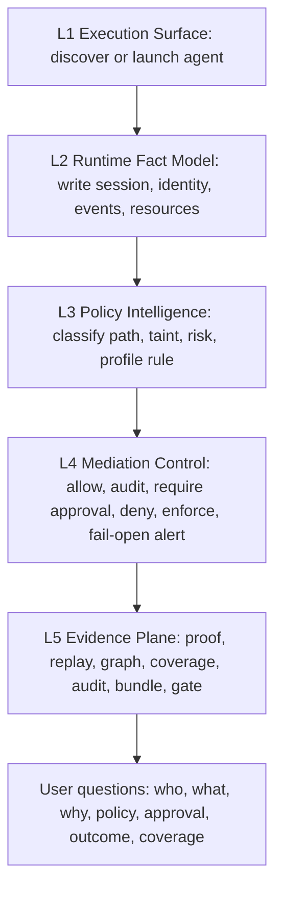

# feat: Agent adapter and L5 runtime operation plan before 1.0

## Summary

Invart 0.9.2 has a credible local control-plane story: runtime events enter a ledger, decisions produce proof, replay and evidence artifacts, and the release gate checks documentation, benchmarks, brand assets, and local demos. The next pre-1.0 line should close two remaining product gaps:

1. Real agent adaptation: Claude Code, Codex, Hermes, OpenClaw, and adjacent agent products must be validated through explicit adapter contracts, not only through generic wrappers or docs claims.
2. Five-layer runtime usage: L1-L5 must become something a user can operate, inspect, and verify from the CLI and docs, not only an architecture diagram.

The core product promise should stay strict: Invart is the runtime control plane around agents. Plugin, hook, and vendor-native integration are useful surfaces, but they are not automatically equivalent to mediated or enforced control. Every product claim must carry a coverage grade and evidence link.

## System Frame

Objective function:

- Maximize truthful evidence that Invart can observe, mediate, and audit real agent workflows across heterogeneous runtimes.
- Minimize false confidence from plugin-only, trace-only, or vendor-owned surfaces.
- Make the five-layer model operational: users should know what to run at L1, what evidence appears at L2, what policies fire at L3, what mediation happens at L4, and what proof exists at L5.

System boundary:

- In scope: local CLI, daemon/session registry, adapter profile contract, managed launcher, native inventory, bridge/hook normalization, mediation, coverage grading, evidence bundles, benchmark suites, RC gate, and public docs.
- Out of scope for this line: hosted admin UI, IdP/SCIM, kernel-level enforcement, full SIEM/OTel integration, graph database backend, universal bypass prevention, and claiming complete vendor-private runtime visibility.
- Externally controlled: vendor CLI behavior, vendor hook schemas, product docs, installation channels, remote/cloud agent sandboxes, model/provider behavior, and organization-specific security policy.

State variables:

- Code: `src/invart/surfaces/adapter.py`, `src/invart/surfaces/adapter_profiles.py`, `src/invart/surfaces/claude_adapter.py`, `src/invart/surfaces/native.py`, `src/invart/surfaces/launcher.py`, `src/invart/control/mediation.py`, `src/invart/assurance/evidence_bundle.py`, and `src/invart/evaluation/release_candidate.py`.
- Docs: `docs/product.md`, `docs/quickstart.md`, `docs/cli-reference.md`, `docs/runtime-effect-demo.md`, `docs/architecture.md`, and missing `docs/user-guide.md`.
- Tests: `tests/test_integrations.py`, `tests/test_runtime_foundation.py`, `tests/test_policy_evidence_rc.py`, `tests/test_demos_roadmap.py`, and `tests/test_experiments.py`.
- Evidence: ledger JSONL, proof JSON, replay HTML, path graph JSON/HTML, coverage report, audit report, evidence bundle manifest, RC report, and optional live real-agent reports.

Feedback loop:

- Unit tests prove schema, profile, mediation, and evidence behavior.
- Product workflow tests prove agent-shaped trajectories enter the ledger and produce L1-L5 artifacts.
- Deterministic binary-shaped fixtures prove the real-agent harness logic in CI.
- Optional live mode proves installed products can be launched or imported and that missing live evidence is reported honestly.
- RC gate refuses to call unsupported or discovery-only surfaces full coverage.

Stopping condition:

- The line is complete when a user can run one documented real-agent or fixture-backed workflow and see: agent identity, adapter/profile grade, runtime events, policy decisions, mediation outcomes, coverage label, proof, replay, graph, evidence bundle, and audit explanation mapped to L1-L5.

## Current Evidence

The repo already contains useful building blocks. The plan should deepen them instead of rebuilding sideways.

| Area | Current state | Gap |
|---|---|---|
| Generic adapter | `run_adapter_command` and `run_adapter_runtime` exist in `src/invart/surfaces/adapter.py`. | `run_adapter_runtime` only accepts `claude-code`, `codex`, and `generic`; product-specific claims are shallow. |
| Adapter profile | `build_adapter_profile` exists in `src/invart/surfaces/adapter_profiles.py`. | It is mostly an environment summary and Claude-shaped hint, not a full adapter contract/coverage profile. |
| Claude adapter | `run_claude_code_adapter` exists in `src/invart/surfaces/claude_adapter.py`. | `check_claude_code_environment` currently references an undefined `returncode` and the adapter is not yet the canonical full-adapter reference. |
| Native surfaces | `native_capability_matrix` and `unmanaged_agent_inventory` cover multiple agents in `src/invart/surfaces/native.py`. | Discovery, mediated, and enforced coverage need stricter product-grade semantics and real evidence linkage. |
| Launchers | `src/invart/surfaces/launcher.py` includes managed launcher support for multiple agents. | Launcher install/verify is not connected enough to real-agent conformance and L1-L5 user docs. |
| L5 evidence | Proof, replay, path graph, coverage, audit, evidence bundle, and RC gate exist. | L5 is scattered in docs and commands; users do not yet get one clear evidence workspace or layer-by-layer guide. |
| Docs | Product, quickstart, CLI reference, architecture, runtime-effect demo exist. | They explain concepts but do not teach operational L1-L5 usage. There is no `docs/user-guide.md`. |

## Source References

The agent ecosystem is moving quickly. These sources should be pinned with access dates in the resulting docs or generated reports when product-specific claims are made.

| Product | Relevant surface | Current reference |
|---|---|---|
| Claude Code | hooks, permissions, security lifecycle | <https://code.claude.com/docs/en/hooks>, <https://code.claude.com/docs/en/permissions> |
| OpenAI Codex | sandboxing, approvals, network controls | <https://developers.openai.com/codex/concepts/sandboxing>, <https://developers.openai.com/codex/agent-approvals-security> |
| Gemini CLI | CLI agent, MCP servers | <https://github.com/google-gemini/gemini-cli>, <https://geminicli.com/docs/tools/mcp-server/> |
| Cursor | agent mode, rules, skills, MCP, CLI | <https://cursor.com/docs> |
| OpenCode | agents and plugins | <https://opencode.ai/docs/agents/>, <https://opencode.ai/docs/plugins/> |
| Cline/Roo-like IDE agents | MCP marketplace and IDE extension surface | <https://docs.cline.bot/mcp/mcp-overview>, <https://cline.bot/mcp-marketplace> |
| GitHub Copilot coding agent | cloud agent and firewall | <https://docs.github.com/en/copilot/concepts/agents/cloud-agent/about-cloud-agent>, <https://docs.github.com/en/copilot/how-tos/use-copilot-agents/coding-agent/customize-the-agent-firewall> |
| Hermes | security/container posture | <https://hermes-agent.nousresearch.com/docs/user-guide/security/> |
| OpenClaw | tools, permission/security profile, plugins/skills | <https://docs.openclaw.ai/tools>, <https://docs.openclaw.ai/gateway/security> |

## Requirements

- R1. Define a single adapter contract that names launch method, event sources, hook/import format, coverage grade, evidence requirements, and known blind spots for each product.
- R2. Preserve truthful coverage labels. `observed`, `mediated`, `enforced`, `vendor_owned`, `imported`, and `discovery_only` must not be collapsed.
- R3. Make Claude Code the first reference full adapter because it has local CLI, hook, permission, and wrapper surfaces that can be validated end to end.
- R4. Keep Codex, Gemini CLI, OpenCode, Hermes, OpenClaw, Cursor, Cline/Roo, GitHub Copilot cloud agent, OpenAI Agents SDK, LangGraph, CrewAI, and Aider in one registry with explicit grade and priority.
- R5. Add real-agent conformance as a first-class local and optional live validation loop, extending `docs/plans/2026-06-09-002-feat-real-agent-conformance-plan.md`.
- R6. Turn L1-L5 into a runtime operation workflow with commands, expected artifacts, and pass/fail/coverage interpretation.
- R7. Strengthen L5 so evidence completeness can be inspected, verified, and used as a release gate, not only generated as a bundle.
- R8. Add `docs/user-guide.md` and HTML, and update quickstart/product/CLI docs so new users can operate each layer.
- R9. Tests must be agent-shaped. A passing test should show task, agent action, Invart observation, decision, mediation/outcome, coverage, and evidence, not just a function return value.
- R10. Optional live/heavy tests may be skipped in default CI, but strict live mode must fail when required evidence is missing.

## Key Technical Decisions

- KTD1. Use `AgentAdapterProfile` as the durable product contract. `build_adapter_profile` should evolve from a small helper into a registry-backed profile layer, but callers should retain simple dictionary output for CLI compatibility.
- KTD2. Separate local runtime adapters from vendor/cloud evidence importers. A local CLI adapter can mediate execution; a cloud agent may only support imported evidence unless Invart controls the runtime boundary.
- KTD3. Grade capability by control position, not by product popularity. A plugin with hooks may be `mediated` for hook-covered events but still `observed` or `vendor_owned` for lower-level process/network behavior.
- KTD4. Claude Code becomes the first full-adapter reference. Codex-like and generic wrappers remain supported, but full status requires product-specific launch, event normalization, and artifact completeness tests.
- KTD5. L5 remains derived from the ledger. Evidence workspace, proof, replay, graph, coverage, and audit can add indexes and reports, but the ledger remains the fact source.
- KTD6. Signature, timestamp authority, SIEM export, hosted console, and full signoff workflow stay post-1.0 unless they are needed to avoid a false product claim.

## High-Level Design

### Adapter Control Path

The profile is the contract that says which branch a product is using. A product can have multiple branches at once. For example, Claude Code may have a managed wrapper and hook bridge, while GitHub Copilot cloud agent may start as evidence import plus policy comparison.

### Five-Layer Runtime Operation Flow

The docs and CLI should make each layer executable. A user should not need to reverse-engineer which command belongs to which layer.

### Coverage Grade Taxonomy

| Grade | Meaning | User-facing claim |
|---|---|---|
| `full_managed_adapter` | Invart creates the session, launches or wraps execution, mediates runtime actions, records artifacts, and can block or require approval before side effect for covered surfaces. | Strongest local pre-1.0 claim. |
| `managed_wrapper_adapter` | Invart wraps a child process and mediates visible shell/file/network-shaped events, but some process tree or tool internals are best-effort. | Useful, but must disclose degraded supervision. |
| `native_event_bridge` | Vendor hook/plugin payloads enter Invart and receive normalized decisions/responses. | Strong for covered hook events; not blanket runtime control. |
| `vendor_evidence_import` | Invart imports logs, traces, PRs, or artifacts from a vendor/cloud runtime. | Audit/import only unless Invart controls execution boundary. |
| `discovery_only` | Invart finds config, binaries, plugins, skills, or unmanaged surfaces. | Coverage gap, not mediation. |

## Version Plan

This plan continues the 0.9.x pre-1.0 line. It does not retroactively change 0.9.2.

### v0.9.3 Adapter Contract and Real-Agent Conformance Foundation

Goal:

- Establish one product profile and conformance schema used by adapters, native inventory, benchmarks, docs, and RC gates.

Implementation:

- Fix `check_claude_code_environment` in `src/invart/surfaces/claude_adapter.py`.
- Extend `src/invart/surfaces/adapter_profiles.py` with structured agent profiles.
- Add `AgentAdapterProfile` fields: `agent_id`, `display_name`, `priority`, `execution_modes`, `native_surfaces`, `event_sources`, `coverage_grade`, `claim_boundary`, `required_artifacts`, `source_urls`, and `last_reviewed`.
- Add profile entries for Claude Code, Codex, Gemini CLI, Cursor, OpenCode, OpenClaw, Hermes, Cline/Roo, GitHub Copilot cloud agent, Aider, OpenAI Agents SDK, LangGraph, and CrewAI.
- Add real-agent conformance module that can run deterministic binary-shaped fixtures in CI and optional live validation when configured.
- Extend CLI with a real-agent check/report surface through the integration command group.
- Add benchmark suite for adapter contract and conformance foundation.

Tests:

- Profile registry contains all priority agents with non-empty claim boundaries.
- No product can report `full_managed_adapter` without runtime evidence requirements.
- Claude environment check returns a stable conformance payload and no undefined variable.
- Deterministic fixture for missing binary reports blocked/missing honestly.
- Strict live mode fails when required live evidence is absent.

### v0.9.4 Claude Code Reference Full Adapter

Goal:

- Make Claude Code the first end-to-end full adapter reference.

Implementation:

- Harden `run_claude_code_adapter` as the canonical product-specific adapter.
- Normalize Claude hook payloads into `MediationRequest` records.
- Record permission/config inventory before runtime.
- Record wrapper launch, hook ingest, policy decision, approval state, child outcome, and L5 artifact links.
- Produce an adapter package with ledger, proof, replay, path graph, coverage, audit HTML, and manifest.
- Add explicit degraded-supervision evidence when only portable Python subprocess wrapping is active.

Tests:

- Claude hook event fixture becomes a ledger event with normalized surface and decision.
- Risk-equivalent secret egress or unsafe deletion scenario is blocked or requires approval before side effect under managed profile.
- Benign repo inspection runs without unnecessary approval under advisory profile.
- Adapter package verifies and contains all L5 artifacts.
- Docs and reports distinguish hook-mediated events from process-tree visibility.

### v0.9.5 Priority Agent Profiles and Adapter Tracks

Goal:

- Cover major agent ecosystems truthfully without pretending each has the same integration depth.

Implementation:

- Codex-like local adapter: map sandbox/approval expectations to Invart coverage and imported evidence.
- Gemini CLI and OpenCode: support local wrapper/profile plus MCP/plugin surface inventory.
- Cursor and Cline/Roo: support IDE/plugin/config inventory and bridge/import mode where local execution is not fully controllable.
- Hermes and OpenClaw: align with existing real-agent conformance plan; support managed launcher or imported/runtime evidence depending on installed product shape.
- GitHub Copilot cloud agent: define vendor/cloud evidence importer and firewall/policy comparison boundary.
- Aider: add managed CLI wrapper profile because it is local and shell/repo-oriented.
- OpenAI Agents SDK, LangGraph, and CrewAI: add framework-level trace/import profiles for application-owned agent workflows.

Tests:

- Each profile emits an accurate capability grade.
- Plugin-only and vendor-import-only profiles cannot satisfy mediated/enforced gates.
- Managed local profiles can generate a fixture-backed ledger/proof/evidence bundle.
- Native inventory reports unmanaged surfaces as coverage gaps.
- Product control matrix and docs use the same grade vocabulary.

### v0.9.6 L1-L5 Runtime Operation Workflow

Goal:

- Make the five-layer framework directly usable from CLI and docs.

Implementation:

- Add a layer runtime report generator that consumes existing artifacts and emits a stage-by-layer operation matrix.
- Add or extend CLI so users can inspect what happened at L1-L5 for a run.
- The report should map:
  - L1 to launcher, adapter, native bridge, MCP, scanner, command/file/network surfaces.
  - L2 to session, identity, invocation, resource, taint, grant, outcome ledger facts.
  - L3 to deterministic policy, path-aware policy, LLM reviewer classification, and non-downgrade evidence.
  - L4 to mediation decision, approval lifecycle, enforced block, fail-open alert, and coverage grade.
  - L5 to proof, replay, path graph, coverage report, audit report, evidence bundle, and gate result.
- Use the report in demos and docs rather than duplicating hand-written matrices.

Tests:

- A managed adapter run produces a layer matrix with before/during/after columns and L1-L5 rows.
- Removing proof, replay, path graph, coverage, or audit lowers L5 completeness.
- A discovery-only agent produces an L1 finding and L5 coverage gap, not a false mediation claim.
- JSON fields are stable enough for docs, benchmark, and RC report reuse.

### v0.9.7 L5 Evidence Workspace and Gate Hardening

Goal:

- Turn L5 from "many artifacts exist" into a coherent assurance workspace.

Implementation:

- Add an evidence workspace index over ledger, proof, replay, graph, coverage, audit, bundle manifest, and benchmark/RC reports.
- Add evidence inspection output that answers who/what/why/policy/approval/outcome/coverage for a selected run.
- Extend evidence verification with artifact completeness status and profile/coverage mismatch findings.
- Extend release-candidate gate with optional real-agent requirements and evidence completeness checks.
- Keep signatures and timestamp authority planned, not required for this line.

Tests:

- Evidence workspace verification fails when an artifact is missing or tampered.
- RC gate fails when full-adapter claim lacks adapter package or live evidence in strict mode.
- Evidence report can explain a blocked risk-equivalent trajectory and a benign allowed trajectory.
- `proof` remains portable summary and `ledger` remains fact source.

### v0.9.8 User Guide and Layered Docs Release

Goal:

- Make Invart teachable to a new user without private context.

Implementation:

- Add `docs/user-guide.md` and `docs/html/user-guide.html`.
- Update `docs/quickstart.md` from proof-only flow to a complete but small loop: start session, run command, inspect decision, export proof, replay, graph, coverage, evidence, and audit.
- Update `docs/cli-reference.md` with the integration and evidence commands users actually need.
- Update `docs/product.md` to include "How to operate L1-L5".
- Update `docs/runtime-effect-demo.md` to link the generated layer matrix and evidence workspace.
- Update `docs/index.md`, `docs/html/index.html`, `docs/README.md`, root `README.md`, and RC required docs to include the user guide.

Tests:

- Docs index and root README link the new user guide.
- HTML docs parse and local links resolve.
- CLI examples in docs reference real command groups.
- RC required docs include user guide and runtime effect docs.
- Public docs do not claim complete coverage for plugin-only or discovery-only integrations.

## Implementation Units

### U1 Adapter Profile Contract

Files:

- Modify `src/invart/surfaces/adapter_profiles.py`
- Modify `src/invart/surfaces/native.py`
- Modify `src/invart/commands/parser_integrations.py`
- Modify `src/invart/commands/integrations.py`
- Add or extend `tests/test_integrations.py`

Acceptance:

- Profile registry is the one source for agent product capabilities.
- CLI can inspect a product profile and see grade, sources, expected artifacts, and blind spots.
- Unsupported products fail with a useful message rather than falling back to generic full claims.

### U2 Real-Agent Conformance Runner

Files:

- Add `src/invart/evaluation/real_agent_conformance.py`
- Add or extend `src/invart/benchmarks/releases_v52_v57.py`
- Modify `src/invart/benchmarks/registry.py`
- Modify `src/invart/evaluation/release_candidate.py`
- Add or extend `tests/test_integrations.py` and `tests/test_policy_evidence_rc.py`

Acceptance:

- Fixture-backed conformance validates harness logic in CI.
- Live mode is explicit and strict mode fails on missing required evidence.
- Reports include `blocked_missing_binary`, `blocked_vendor_unavailable`, or equivalent honest statuses.

### U3 Claude Reference Adapter

Files:

- Modify `src/invart/surfaces/claude_adapter.py`
- Modify `src/invart/surfaces/adapter.py`
- Modify `src/invart/surfaces/native_bridge.py`
- Add Claude fixtures under test fixtures if needed
- Add or extend `tests/test_integrations.py` and `tests/test_runtime_foundation.py`

Acceptance:

- Claude-specific hook/wrapper flow produces the full artifact bundle.
- Known environment check bug is fixed.
- Tests prove both benign autonomy and risky intervention.

### U4 Priority Agent Tracks

Files:

- Modify `src/invart/surfaces/adapter_profiles.py`
- Modify `src/invart/surfaces/native.py`
- Modify `src/invart/surfaces/launcher.py`
- Modify `src/invart/evaluation/product_control_matrix.py`
- Add or extend `tests/test_experiments.py` and `tests/test_integrations.py`

Acceptance:

- Each priority product has a documented track: managed adapter, wrapper, native bridge, evidence import, or discovery-only.
- Product control matrix and runtime reports agree on grade names.
- Unsupported control positions are visible as gaps.

### U5 Layer Runtime Report

Files:

- Add `src/invart/assurance/layer_runtime.py`
- Modify `src/invart/commands/parser_product.py` or `src/invart/commands/parser_integrations.py`
- Modify `src/invart/commands/product.py` or `src/invart/commands/integrations.py`
- Modify demo generation modules that emit runtime effect artifacts
- Add or extend `tests/test_demos_roadmap.py`

Acceptance:

- JSON report has stable `runtime_effect_matrix`, `layer_timeline`, and `layer_artifacts`.
- HTML report shows before/during/after by L1-L5.
- Missing L5 artifacts are reported as incomplete rather than ignored.

### U6 Evidence Workspace and Gate

Files:

- Modify `src/invart/assurance/evidence_bundle.py`
- Add `src/invart/assurance/evidence_workspace.py` if needed
- Modify `src/invart/evaluation/release_candidate.py`
- Modify CLI parser/handlers for evidence inspection if needed
- Add or extend `tests/test_policy_evidence_rc.py`

Acceptance:

- Evidence workspace verifies artifact integrity and completeness.
- RC gate can require adapter package, L1-L5 matrix, and real-agent evidence when configured.
- Report answers accountable principal, agent, grant, decision, approval, outcome, and coverage.

### U7 Public Docs

Files:

- Add `docs/user-guide.md`
- Add `docs/html/user-guide.html`
- Modify `docs/quickstart.md` and `docs/html/quickstart.html`
- Modify `docs/product.md` and `docs/html/product.html`
- Modify `docs/cli-reference.md` and `docs/html/cli-reference.html`
- Modify `docs/runtime-effect-demo.md` and `docs/html/runtime-effect-demo.html`
- Modify `docs/index.md`, `docs/html/index.html`, `docs/README.md`, and `README.md`
- Modify `src/invart/evaluation/release_candidate.py`

Acceptance:

- New user path is clear: quickstart, user guide, runtime effect demo, CLI reference, API/SDK, evaluation.
- Layer operations are documented with expected outputs and interpretation.
- Docs keep claim boundaries honest.

## Test Strategy

The test strategy should stay test-driven, but each test should represent a product question.

| Test type | Product question | Required evidence |
|---|---|---|
| Profile contract test | What does Invart claim it can do for this product? | Profile grade, source URLs, blind spots, required artifacts. |
| Adapter workflow test | Can a real or fixture agent enter Invart's control plane? | Session, identity, ledger, mediation, outcome, proof. |
| Risk intervention test | Does Invart block or pause risky side effects before they happen? | Decision, approval/block outcome, no side-effect artifact. |
| Benign autonomy test | Does Invart avoid excessive friction for ordinary work? | Allowed/audited outcome, low approval count, artifact compatibility. |
| L1-L5 report test | Can a user understand each layer's effect? | Runtime effect matrix, layer timeline, artifact links. |
| Evidence integrity test | Can security review trust the bundle? | Stable hashes, tamper detection, completeness status. |
| RC gate test | Can release claims be falsified? | Missing docs/tests/benchmarks/evidence cause fail. |
| Optional live test | Does this work against installed products? | Live binary/version/run evidence or explicit blocked status. |

Minimum agent-shaped cases:

- Benign repo inspection: list files, read non-sensitive docs, produce proof without approval noise.
- Secret egress risk: read dummy secret then attempt network/upload equivalent; must block or require approval under managed profile.
- Unsafe deletion risk: destructive shell or file deletion equivalent; must block or require approval.
- External instruction hijack: untrusted instruction attempts to modify CI/deploy/auth file; path-aware policy must escalate.
- Skill/plugin supply-chain scan: directory-level skill/tool scan produces pre-runtime findings and coverage boundary.
- Vendor/cloud import: imported run shows evidence boundary and cannot claim mediation unless Invart controlled the runtime.

## Documentation Plan

The docs should move from concept-first to task-first.

| User task | Primary doc | What it should answer |
|---|---|---|
| First contact | `docs/product.md` | What is Invart and why does runtime control matter? |
| Try it now | `docs/quickstart.md` | How do I run a small closed loop and see artifacts? |
| Use it for real | `docs/user-guide.md` | How do I operate L1-L5 and interpret outcomes? |
| Integrate an agent | `docs/cli-reference.md` and `docs/api-sdk.md` | Which CLI/API surfaces are stable? |
| Understand architecture | `docs/architecture.md` | How do ledger, policy, mediation, and evidence fit together? |
| See effect | `docs/runtime-effect-demo.md` | How do before/during/after and L1-L5 appear in demo artifacts? |
| Validate claims | `docs/evaluation.md` | Which benchmarks and gates prove the product loop? |

## Risks And Mitigations

| Risk | Mitigation |
|---|---|
| Adapter scope explodes across many products. | Make profiles universal but full adapters incremental; Claude first, others graded honestly. |
| Plugin integration is mistaken for full runtime control. | Enforce coverage grade taxonomy in profiles, docs, benchmarks, and RC reports. |
| Live vendor tests are flaky. | Keep deterministic fixtures in CI and strict live mode opt-in; never report missing live runs as pass. |
| L5 becomes a pile of files users cannot understand. | Add evidence workspace index and layer report that answer concrete audit questions. |
| Docs overpromise. | Add tests for claim boundary language and ensure discovery-only surfaces cannot satisfy mediated/enforced claims. |
| Users want UI before control semantics are settled. | Keep this line CLI/docs/demo only; UI can consume the same L5 workspace later. |

## Success Metrics

- Every priority product has an adapter profile with coverage grade and claim boundary.
- Claude Code has one end-to-end adapter workflow with artifact bundle verification.
- The product control matrix can show at least one managed local adapter, one native bridge, one vendor import, and one discovery-only gap.
- A new user can follow docs from quickstart to L1-L5 user guide without private explanation.
- Evidence workspace can answer: who, agent, grant, credential boundary, what happened, why allowed/blocked, policy, approval, outcome, coverage.
- RC gate can fail on missing L1-L5 report, missing evidence bundle, or unsupported full-adapter claim.

## Release Boundary

This plan should produce a stronger pre-1.0 local release, not a hosted enterprise GA.

Included before 1.0:

- Local CLI agent profiles.
- Claude reference full adapter.
- Fixture-backed real-agent conformance.
- Optional strict live real-agent validation.
- L1-L5 runtime operation docs and reports.
- Evidence workspace completeness and RC gate integration.

Post-1.0 planned:

- Hosted admin console.
- IdP/SCIM identity binding.
- Organization policy distribution service.
- Full signoff workflow.
- Signature/timestamp authority.
- SIEM/OTel production export.
- Kernel-level enforcement.
- Graph database backend.

## Acceptance Examples

- AE1. Given a Claude Code fixture hook event and managed wrapper run, when the adapter executes, then ledger, proof, replay, path graph, coverage, audit, evidence bundle, and layer matrix all exist and verify.
- AE2. Given an OpenCode plugin-only profile, when RC asks for enforced runtime coverage, then the gate fails with a coverage mismatch instead of passing.
- AE3. Given a GitHub Copilot cloud agent imported artifact, when evidence is attached, then Invart reports vendor evidence import and does not claim runtime mediation.
- AE4. Given a benign repo inspection task, when run through a managed adapter, then the action is allowed or audited and approval count remains low.
- AE5. Given a secret-egress risk path, when run under managed profile, then the action is denied or paused for approval before side-effect and L5 can reconstruct the path.
- AE6. Given a missing `docs/user-guide.md`, when RC runs required docs checks, then RC fails.
- AE7. Given a tampered proof or missing path graph, when evidence workspace verifies, then L5 completeness fails and names the missing or altered artifact.

## Immediate Next Step

Start with v0.9.3 because it fixes the contract. The first concrete development slice should be:

1. Write failing tests for agent profile registry, Claude environment check, fixture-backed conformance report, and coverage-grade non-inflation.
2. Implement the smallest profile contract extension and fix the Claude check bug.
3. Add CLI inspection/reporting and benchmark registration.
4. Update docs only after the behavior and test artifacts are real.

Do not start by writing another marketing/demo page. The next layer of value is the contract that makes future demos truthful.
