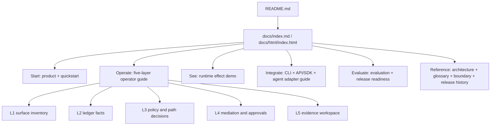
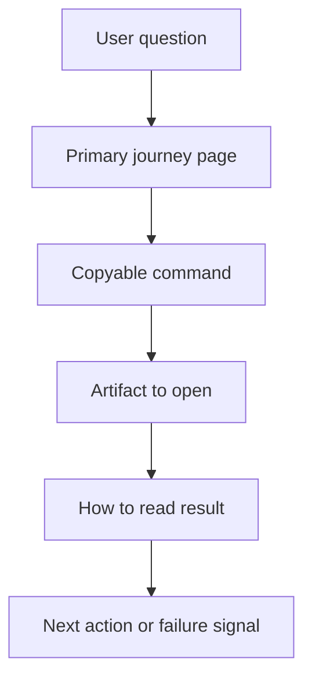

# docs: Reorganize user documentation around operator journeys

## Summary

This plan reorganizes Invart's public documentation around the way a new user actually adopts the product: understand the promise, run one controlled session, operate the five runtime layers, integrate a real agent, evaluate evidence, then use reference material. The work keeps the current Markdown plus HTML publishing model, but reduces duplicated conceptual pages and makes the L1-L5 model executable instead of only explanatory.

---

## Problem Frame

The current docs are complete enough to prove capability, but they are not yet shaped as a low-friction user journey. `docs/product.md`, `docs/architecture.md`, and `docs/runtime-effect-demo.md` all explain the three-stage and five-layer model from different angles. `docs/quickstart.md` proves the minimum ledger/proof loop, but it does not teach users how to operate L1-L5. `docs/concepts.md` and `docs/examples.md` are useful content fragments, but they are too thin to be first-class entry points. The result is a high reading cost: users must stitch together product value, commands, artifacts, evidence claims, and runtime layer semantics by themselves.

The reorganization should improve comprehension without overstating product maturity. Invart remains a CLI-first 0.9 pre-release with local demos, adapter work, evidence bundles, and optional external validation. The docs must continue to distinguish observed, mediated, enforced, fail-open, and unmanaged coverage.

---

## Requirements

- R1. Make `docs/index.md` and `docs/html/index.html` route users by task: first look, install, run, operate L1-L5, integrate agents, evaluate evidence, and reference APIs.
- R2. Add a practical five-layer operator guide that maps each layer to a user question, command, expected artifact, interpretation rule, and failure signal.
- R3. Merge thin concept and example content into the journey pages where users need it, while preserving compatibility links for existing URLs.
- R4. Keep `docs/runtime-effect-demo.md` focused on reading demo artifacts rather than carrying the full five-layer operating model.
- R5. Keep architecture documentation for implementers, but remove duplicated product tutorial content and link to the operator guide for usage.
- R6. Preserve the Markdown plus HTML contract: every public Markdown page has an HTML counterpart under `docs/html/`, with richer matrices and diagrams allowed in HTML.
- R7. Update README, docs README, release-candidate required docs, and documentation tests so the new structure is enforced.
- R8. Archive or demote historical/release-only pages out of the main user journey without breaking open-source boundary expectations.
- R9. Keep all examples safe and local-first; no doc should imply live external benchmark completion or stronger runtime enforcement than the artifact proves.

---

## Key Technical Decisions

- KTD1. Use task journeys as the information architecture: users should choose docs based on what they are trying to do, not based on Invart's internal module boundaries.
- KTD2. Keep flat public doc paths for now: top-level `docs/*.md` plus `docs/html/*.html` already have tests and GitHub-friendly links, so this plan avoids a disruptive directory migration before 1.0.
- KTD3. Add one new primary guide instead of several small pages: `docs/five-layer-operator-guide.md` becomes the missing bridge between conceptual model and CLI operation.
- KTD4. Convert `concepts.md` and `examples.md` into secondary reference pages: their content should be folded into `product.md`, `quickstart.md`, and the five-layer guide, while the old pages remain as compatibility indexes for one release cycle.
- KTD5. Treat `release-history.md` and `open-source-boundary.md` as project-boundary references, not first-run material: keep them public but move them below the main Start / Operate / Integrate / Evaluate routes.
- KTD6. Test the documentation as product surface: docs tests should assert link coverage, Markdown/HTML pairing, required RC docs, and the presence of operator-guide decision tables, not just file existence.

---

## High-Level Technical Design

The core design rule is that every first-class user page should answer: what is the user trying to do, which command do they run, which artifact do they open, how do they interpret it, and what should they do next.

---

## Proposed Documentation Map

| Page | Future role | Action |
| --- | --- | --- |
| `README.md` | GitHub landing page and shortest product path | Keep, shorten doc list into journey links, add five-layer guide as primary route. |
| `docs/index.md` / `docs/html/index.html` | Main documentation router | Rewrite around user journeys: Start, Operate, Integrate, Evaluate, Reference. |
| `docs/product.md` / HTML | Product promise and mental model | Keep; fold the essential glossary into it; reduce command depth. |
| `docs/quickstart.md` / HTML | Ten-minute local session | Expand from ledger/proof only into a short run that points to L1-L5 inspection. |
| `docs/five-layer-operator-guide.md` / HTML | Practical L1-L5 operating manual | Add as the central usage guide. |
| `docs/runtime-effect-demo.md` / HTML | How to read demo matrix and timelines | Keep; remove broad duplicated definitions and link to the operator guide. |
| `docs/cli-reference.md` / HTML | Command reference | Keep; add "user question to command" cross-links and ensure examples match actual CLI. |
| `docs/api-sdk.md` / HTML | Stable integration boundaries | Keep; link artifact contracts to L5 evidence and operator guide. |
| `docs/evaluation.md` / HTML | Benchmark and evidence validation | Keep; add a clearer "which benchmark proves which product claim" table. |
| `docs/architecture.md` / HTML | Implementer architecture | Keep; demote tutorial prose, preserve module mapping, add a layer-to-module diagram. |
| `docs/concepts.md` / HTML | Glossary compatibility page | Demote; keep as a reference index after folding key terms into product/operator pages. |
| `docs/examples.md` / HTML | Compatibility index for examples | Demote; move actual examples into quickstart/operator sections and leave links to `examples/`. |
| `docs/open-source-boundary.md` / HTML | Project boundary reference | Keep under Reference, not Start. |
| `docs/release-history.md` / HTML | Version/capability reference | Keep under Reference, not Start or Understand. |

---

## Scope Boundaries

### In Scope

- Public documentation information architecture.
- Markdown and HTML page updates under `docs/` and `docs/html/`.
- README and docs README navigation updates.
- Release-candidate required-docs list updates.
- Documentation tests that assert pairing, links, and operator-guide content.
- Safe local commands and demo artifact interpretation guidance.

### Deferred to Follow-Up Work

- Hosted documentation site generation with MkDocs, Sphinx, Docusaurus, or a custom renderer.
- UI product work or hosted enterprise console documentation.
- Full live-agent validation screenshots for every vendor product.
- Full external benchmark result publication.
- Removing compatibility pages immediately; this plan keeps demoted pages for one release cycle.

### Outside This Product Identity

- Claiming plugin-only integration equals full runtime control.
- Claiming local demo fixtures reproduce private incidents or complete external benchmarks.
- Claiming observed-only traces are mediated or enforced.

---

## Implementation Units

### U1. Define The User Journey Index

- **Goal:** Rewrite the docs home pages so users see a small number of task paths instead of a flat page inventory.
- **Requirements:** R1, R6, R7.
- **Dependencies:** None.
- **Files:**
  - Modify `docs/index.md`
  - Modify `docs/html/index.html`
  - Modify `docs/README.md`
  - Modify `README.md`
  - Modify tests in `tests/test_policy_evidence_rc.py`
- **Approach:** Use five top-level routes: Start, Operate, Integrate, Evaluate, Reference. Keep `docs/html/style.css` unless the existing layout cannot express a clearer journey grid. The HTML page can use a compact flow/matrix, but Markdown should remain simple and GitHub-readable.
- **Patterns to follow:** Current `docs/index.md` grouping and `docs/html/index.html` card grid.
- **Test scenarios:**
  - Assert `docs/index.md` and `docs/html/index.html` link to every first-class public journey page.
  - Assert no public Markdown page except `docs/README.md` and plan files is orphaned from either docs README or docs index.
  - Assert root README links to the main journey pages, not a long unprioritized inventory.
- **Verification:** A new user can identify the correct first page for install, five-layer operation, real-agent integration, and evaluation in one scan.

### U2. Add The Five-Layer Operator Guide

- **Goal:** Create the practical missing guide that turns L1-L5 into executable user behavior.
- **Requirements:** R2, R4, R6, R9.
- **Dependencies:** U1.
- **Files:**
  - Create `docs/five-layer-operator-guide.md`
  - Create `docs/html/five-layer-operator-guide.html`
  - Modify `docs/runtime-effect-demo.md`
  - Modify `docs/html/runtime-effect-demo.html`
  - Modify `docs/cli-reference.md`
  - Modify `docs/html/cli-reference.html`
  - Modify tests in `tests/test_policy_evidence_rc.py`
- **Approach:** Structure the guide by user question, not by product jargon. Each layer should include the question it answers, the command to run, the artifact to open, healthy output, failure signal, and next action. Include a compact "I want to know X" decision table and a full before/during/after x L1-L5 matrix in HTML.
- **Patterns to follow:** `src/invart/assurance/layer_runtime.py` operations, `docs/runtime-effect-demo.md` Layer Operation Flow, and `docs/html/runtime-effect-demo.html` artifact mapping.
- **Test scenarios:**
  - Assert the guide contains all five layer names, before/during/after terminology, and coverage labels `observed`, `mediated`, `enforced`, and `fail-open`.
  - Assert the guide includes commands for `pre-runtime`, `runtime layers`, `policy check-path`, `mediation inspect`, and `evidence inspect`.
  - Assert the HTML guide links to `runtime-effect-demo.html`, `cli-reference.html`, and `evaluation.html`.
  - Assert release-candidate required docs include both Markdown and HTML operator-guide pages.
- **Verification:** A user can run one ledger-backed session and inspect every layer without reading architecture source layout first.

### U3. Merge Thin Concepts And Examples Into The Journey

- **Goal:** Reduce first-time reading cost by moving small concept and example fragments into the pages where they are used.
- **Requirements:** R3, R8, R9.
- **Dependencies:** U1, U2.
- **Files:**
  - Modify `docs/product.md`
  - Modify `docs/html/product.html`
  - Modify `docs/quickstart.md`
  - Modify `docs/html/quickstart.html`
  - Modify `docs/concepts.md`
  - Modify `docs/html/concepts.html`
  - Modify `docs/examples.md`
  - Modify `docs/html/examples.html`
  - Modify tests in `tests/test_policy_evidence_rc.py`
- **Approach:** Fold the glossary terms that users need immediately into `product.md` and the operator guide. Move runnable example context into `quickstart.md` and the operator guide. Keep `concepts.md` and `examples.md` as compatibility reference indexes that say where the active guidance now lives.
- **Patterns to follow:** Existing concise tables in `docs/concepts.md` and `docs/examples.md`.
- **Test scenarios:**
  - Assert `concepts.md` links to product, operator guide, architecture, and API/SDK pages.
  - Assert `examples.md` links to quickstart, operator guide, `examples/basic-managed-session.sh`, `examples/policy-profile.toml`, and `examples/unsafe-action-event.json`.
  - Assert no example command implies execution of unsafe behavior; unsafe examples must stay analyze-only or demo-fixture based.
- **Verification:** A first-time reader no longer has to open a separate glossary before understanding the quickstart or five-layer guide.

### U4. Refocus Product, Runtime Demo, And Architecture Pages

- **Goal:** Give each major explanatory page one job and remove duplicate five-layer definitions.
- **Requirements:** R4, R5, R9.
- **Dependencies:** U2, U3.
- **Files:**
  - Modify `docs/product.md`
  - Modify `docs/html/product.html`
  - Modify `docs/runtime-effect-demo.md`
  - Modify `docs/html/runtime-effect-demo.html`
  - Modify `docs/architecture.md`
  - Modify `docs/html/architecture.html`
  - Modify tests in `tests/test_policy_evidence_rc.py`
- **Approach:** Product page explains why Invart exists and what value it gives. Runtime effect demo explains how to read generated demo artifacts. Architecture explains system shape and module boundaries. The operator guide owns "how do I use L1-L5".
- **Patterns to follow:** Existing `docs/architecture.md` source layout table and `src/invart/evaluation/pre_1_0.py` runtime effect matrix.
- **Test scenarios:**
  - Assert product page links to quickstart and operator guide before architecture.
  - Assert runtime effect demo describes artifact interpretation and links to the operator guide for command-level operation.
  - Assert architecture page includes layer-to-module mapping and links to operator guide without duplicating command tables.
- **Verification:** A reader can predict whether to open product, demo, architecture, or operator guide based on their task.

### U5. Tighten Integration And Evaluation Routes

- **Goal:** Make real-agent integration, API/SDK boundaries, and evaluation evidence easier to discover from the user journey.
- **Requirements:** R1, R6, R7, R9.
- **Dependencies:** U1, U2.
- **Files:**
  - Modify `docs/cli-reference.md`
  - Modify `docs/html/cli-reference.html`
  - Modify `docs/api-sdk.md`
  - Modify `docs/html/api-sdk.html`
  - Modify `docs/evaluation.md`
  - Modify `docs/html/evaluation.html`
  - Modify `docs/release-history.md`
  - Modify `docs/html/release-history.html`
  - Modify tests in `tests/test_policy_evidence_rc.py`
- **Approach:** CLI reference remains command-first but should begin with common user intents. API/SDK should state that artifact contracts are the stable integration boundary and link L5 evidence terms back to the operator guide. Evaluation should map product claims to benchmarks and artifacts.
- **Patterns to follow:** Current `docs/api-sdk.md` stability table and `docs/evaluation.md` metrics table.
- **Test scenarios:**
  - Assert CLI reference has an intent-to-command section for scan, run, inspect layers, integrate agent, export evidence, and evaluate.
  - Assert API/SDK page links artifact contracts to the operator guide and evidence workspace.
  - Assert evaluation page maps at least five product claims to benchmark commands and expected artifacts.
  - Assert release history remains linked only from Reference sections, not as a Start path.
- **Verification:** Users can find the right command group without reading release history or source modules.

### U6. Update Release Gate And Documentation Tests

- **Goal:** Make the new information architecture enforceable in CI and RC checks.
- **Requirements:** R6, R7, R8.
- **Dependencies:** U1, U2, U3, U4, U5.
- **Files:**
  - Modify `src/invart/evaluation/release_candidate.py`
  - Modify `tests/test_policy_evidence_rc.py`
  - Modify `tests/test_release_structure.py` if structure checks need to account for the new public page.
- **Approach:** Add the operator guide to `DEFAULT_REQUIRED_DOCS`. Extend the existing docs link/parser test rather than creating a parallel mechanism. Add a small "public docs IA" assertion that validates journey sections and Markdown/HTML pairing.
- **Patterns to follow:** `test_public_docs_include_api_sdk_page_and_valid_local_links` and `DEFAULT_REQUIRED_DOCS`.
- **Test scenarios:**
  - RC docs check fails when either operator-guide file is missing.
  - HTML local link parser passes for the new page.
  - Every public Markdown page has an HTML counterpart.
  - Demoted compatibility pages remain linked but do not appear as primary Start cards.
- **Verification:** `release-candidate verify` cannot pass with the old docs structure missing the five-layer operator path.

---

## Archive And Demotion Policy

- `docs/concepts.md` is demoted, not deleted. It becomes a glossary index with links to the active product and operator pages.
- `docs/examples.md` is demoted, not deleted. It becomes an examples index that points to runnable files and the quickstart/operator flows.
- `docs/release-history.md` remains public but moves to Reference. It should not be presented as a first-run learning path.
- Historical long-form plans and design discussions stay in local-only `internal/` or ignored `docs/plans/` artifacts unless explicitly promoted.
- No public URL should break during the 0.9 pre-release; removal can be reconsidered after 1.0 docs analytics or user feedback.

---

## Documentation Acceptance Examples

- AE1. A new user opens `README.md`, clicks one docs link, and can choose between "run the quickstart" and "understand the control model" without scanning the full page inventory.
- AE2. A user with an existing ledger opens the five-layer operator guide and can produce `layer-runtime-workflow.html` and `evidence-workspace.html` with clear interpretation instructions.
- AE3. A security reviewer can follow Evaluation to identify which benchmark or demo artifact supports a claim about secret egress, unsafe deletion, coverage truthfulness, or audit reconstruction.
- AE4. A developer integrating a new agent can start from CLI/API docs and understand when they are using stable CLI/artifact contracts versus provisional Python helpers.
- AE5. A maintainer can run the RC gate and have it fail if the operator-guide docs or HTML counterparts are missing.

---

## Risks & Dependencies

- The main risk is over-abstracting the docs again. The operator guide must stay command-and-artifact-first.
- Demoting `concepts.md` and `examples.md` can feel like churn if links are not preserved. Keep compatibility pages for one release cycle.
- Adding new required docs will break RC until both Markdown and HTML are added. Land U2 and U6 together or keep tests aligned in the same change.
- HTML and Markdown can drift because they are hand-written. Tests should assert key phrases and links, but implementation should also keep a small manual parity checklist in `docs/README.md`.

---

## Sources And Current Patterns

- `docs/index.md` and `docs/html/index.html` already group pages into Start, Understand, Integrate, and Evaluate.
- `docs/runtime-effect-demo.md` already contains the L1-L5 operation flow but mixes demo reading with operational guidance.
- `docs/quickstart.md` proves ledger and proof but does not yet drive users through layer inspection.
- `docs/concepts.md` and `docs/examples.md` are concise fragments that should feed the journey pages.
- `tests/test_policy_evidence_rc.py` already validates Markdown/HTML pairs, local HTML links, docs README entries, root README links, and RC required docs.
- `src/invart/evaluation/release_candidate.py` owns `DEFAULT_REQUIRED_DOCS`.
